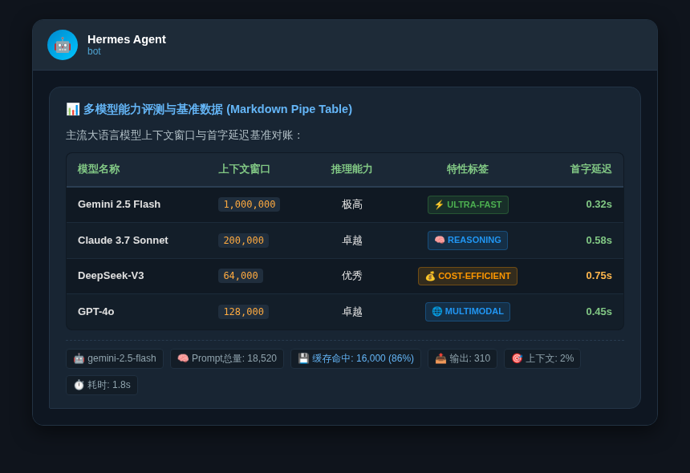

# 🛠️ Hermes Patches

> **Non-intrusive Production Enhancement Patches for Hermes Agent**  
> Supercharge your [Hermes Agent](https://github.com/NousResearch/hermes-agent) deployment with **exact token telemetry & cache hit metering, Telegram native Markdown pipe table bypass, localized bot command menu, and SQLite production concurrency auto-healing**.

<p align="center">
  <b>English</b> | <a href="README.md"><b>简体中文</b></a>
</p>

<p align="center">
  <a href="https://github.com/shali10/hermes-patches/actions/workflows/test.yml"></a>
  <a href="https://opensource.org/licenses/MIT"></a>
  <a href="https://python.org"></a>
  <a href="https://github.com/NousResearch/hermes-agent"></a>
  <a href="https://github.com/shali10/hermes-patches/pulls"></a>
</p>

---

## ✨ Features & Comparison

| Module | Upstream Vanilla | With hermes-patches ✨ |
|---|---|---|
| **📊 Token Telemetry** | Minimal model & percentage only (`gpt-4o · 7%`) | **Full telemetry**: Prompt total, cache hits & hit rate (%), output tokens, context %, and execution latency with formatted integers. |
| **📑 Telegram Pipe Tables** | Markdown tables often degraded to plain unordered lists | **100% bypass for native pipe tables**, rendering modern rich text tables on desktop & mobile Telegram clients. |
| **🇨🇳 Telegram Menu i18n** | English default descriptions only | **Localized command descriptions** for clearer command quick-actions. |
| **🛡️ SQLite Durability** | Prone to `database is locked` or `FOREIGN KEY` crashes during high concurrency | **Automatic `busy_timeout=5000` contention queue + foreign key session auto-healing**. |
| **⚡ Approval Optimization** | Low-severity static analysis warnings interrupt execution | **Automatic pass-through for non-blocking LOW/INFO scanner warnings**. |
| **🚀 Upgrade-Immune Guard** | Hermes source updates overwrite local patches | **systemd `ExecStartPre` supervision hook**, automatically re-applying patches on restart. |

---

## 🔍 Showcase

### 1. 📊 Full Runtime Footer Telemetry

* **Vanilla Default**:
  ```text
  LongCat-2.0 · 7%
  ```

* **With hermes-patches**:
  ```text
  🤖 gemini-3.7-flash-high | 🧠 Prompt总量: 45,210 | 💾 缓存命中: 40,000 (88%) | 📤 输出: 280 | 🎯 上下文: 4% | ⏱️ 耗时: 3.2s
  ```

---

### 2. 📑 Native Telegram Markdown Pipe Table Rendering

<p align="center">
  
</p>

---

## 🏗️ Architecture & How It Works

`hermes-patches` uses **safe code injection validated by Python's bytecode compiler** coupled with **systemd startup supervision**:

```text
               ┌──────────────────────────────┐
               │    Hermes Gateway Service    │
               └──────────────┬───────────────┘
                              │
                    (systemd ExecStartPre)
                              ▼
               ┌──────────────────────────────┐
               │   hermes-patches Engine      │
               │   • Inspects source files    │
               │   • py_compile syntax test   │
               │   • Idempotent atomic update │
               └──────────────┬───────────────┘
                              │
                              ▼
               ┌──────────────────────────────┐
               │     Hermes Core Ready        │
               │  [Telemetry | Pipe Tables    │
               │   DB Healing | Localized UI] │
               └──────────────────────────────┘
```

---

## 🛡️ Production Safety Design

1. **🔬 Atomic Compilation Verification**: All transformations are performed in isolated temporary files and checked via Python's native `py_compile.compile(..., doraise=True)`. The target file is replaced atomically (`os.replace`) ONLY when syntax passes.
2. **🔄 100% Idempotent**: Safe to run repeatedly; signatures prevent duplicate code injection.
3. **💾 Automatic Mirror Backups (`.bak`)**: Automatically creates `.bak` backups before modifying any files, enabling instantaneous rollback.

---

## 🚀 Quick Start (Installation)

### 1. Standard One-Line Install

Run on your Linux server hosting Hermes Agent:

```bash
curl -fsSL https://raw.githubusercontent.com/shali10/hermes-patches/main/install.sh | bash
```

### 2. Selective / Modular Patching

```bash
# Apply specific modules only (footer, table, menu, db, tirith)
curl -fsSL https://raw.githubusercontent.com/shali10/hermes-patches/main/install.sh | bash -s -- --only table db

# Skip specific modules (e.g., skip Chinese menu localization)
curl -fsSL https://raw.githubusercontent.com/shali10/hermes-patches/main/install.sh | bash -s -- --skip menu
```

### 3. Dry Run / Preview Changes

```bash
# List available patch modules
curl -fsSL https://raw.githubusercontent.com/shali10/hermes-patches/main/install.sh | bash -s -- --list-patches

# Inspect diffs without modifying files
curl -fsSL https://raw.githubusercontent.com/shali10/hermes-patches/main/install.sh | bash -s -- --dry-run -v
```

### 4. Docker / Container Integration

Add this line into your `Dockerfile`:

```dockerfile
# Dockerfile
RUN curl -fsSL https://raw.githubusercontent.com/shali10/hermes-patches/main/install.sh | bash
```

---

## ⚙️ Configuration (`~/.hermes/config.yaml`)

The installer configures this automatically. You can customize fields in `~/.hermes/config.yaml`:

```yaml
display:
  runtime_footer:
    enabled: true
    fields:
      - model          # 🤖 Model identifier
      - prompt_tokens  # 🧠 Prompt tokens total
      - cache_read     # 💾 Cache read hits & percentage (%)
      - output_tokens  # 📤 Generated output tokens
      - context_pct    # 🎯 Context window usage (%)
      - elapsed_time   # ⏱️ Wall-clock turnaround time (seconds)
```

---

## ❓ FAQ & Troubleshooting

<details>
<summary><b>Q: I don't see the new footer in Telegram after installation.</b></summary>

> **A**: Changes take effect when the Hermes Gateway restarts. Send `/restart` in Telegram or run `systemctl restart hermes-gateway` on your server.
</details>

<details>
<summary><b>Q: Do I need to reinstall after updating Hermes Agent (<code>hermes update</code>)?</b></summary>

> **A**: **No**. The installer sets up an `ExecStartPre` hook in `hermes-gateway.service` that re-applies patches automatically on every service start.
</details>

<details>
<summary><b>Q: What SQLite issues does this solve?</b></summary>

> **A**:
> 1. `sqlite3.OperationalError: database is locked`: Mitigated via `PRAGMA busy_timeout = 5000` connection queuing.
> 2. `sqlite3.IntegrityError: FOREIGN KEY constraint failed`: Auto-healed via `INSERT OR IGNORE INTO sessions`.
</details>

---

## 🗑️ Uninstall

To restore upstream vanilla files:

```bash
curl -fsSL https://raw.githubusercontent.com/shali10/hermes-patches/main/install.sh | bash -s -- --uninstall
```

---

## 🤝 Contributing

Contributions, bug reports, and suggestions are welcome!

- **Upstream Project**: [NousResearch/hermes-agent](https://github.com/NousResearch/hermes-agent)
- **License**: [MIT](LICENSE)
